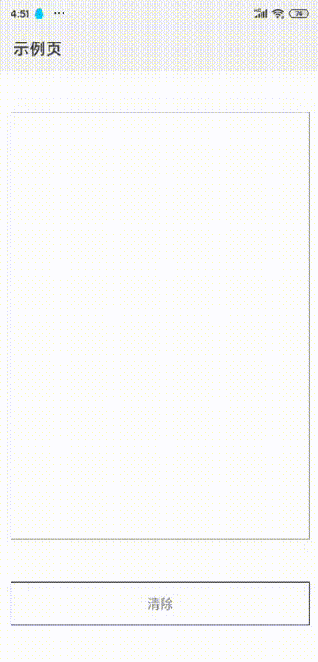

快应用写字板

听过快应用canvas，实现写字板功能，待加入功能

1. 更换颜色
1. 保存图片
1. 设置背景
1. 图片编辑
1. 粗细调整

## 使用方式

### 1 引入JSSDK
将dist内文件复制到快应用根目录，在`app.ux`文件中引入

```js
import './quickapp_write_1.0.0.min.js'
```

### 2 初始化canvas

在页面中定义`canvas`标签，设置好样式，设置id

```vue
<template>
  <!-- template里只能有一个根节点 -->
  <div class="demo-page">
    <canvas 
      id="canvas"
      @touchstart="events"  // 必填
      @touchmove="events"   // 必填
    ></canvas>
    <div class="clear" @click="clear">
      <text>清除</text>
    </div>
  </div>
</template>

<script>
import router from '@system.router'

export default {
  // 页面级组件的数据模型，影响传入数据的覆盖机制：private内定义的属性不允许被覆盖
  private: {
    title: '示例页面',
    qw: {}
  },
  onReady() {
    $quickapp_write.init(this,'canvas');  // 初始化
  },
  click(evt) {
    console.log(evt)
  },
  events(evt) {
    switch (evt.type) {
      case 'touchstart':
        $quickapp_write.touchstart(evt);
        break;
      case 'touchmove':
        $quickapp_write.touchmove(evt);
        break;
      case 'touchend':
        $quickapp_write.touchend(evt);
        break;
    }
    console.log(evt.type)
  },
  clear() {
    $quickapp_write.clear();
  }
}
</script>

<style>
  .demo-page {
    width: 100%;
    height: 100%;
    flex-direction: column;
    justify-content: center;
    align-items: center;
  }
  #canvas {
    width: 700px;
    height: 1000px;
    border: 1px solid #666;
  }
  .clear {
    margin-top: 100px;
    width: 700px;
    height: 100px;
    border: 1px solid #000;
    justify-content: center;
    align-items: center;
  }
</style>

```

### 3 效果




### 4 开发方式

调试

```bash
npm run dev
```

```bash
cd demo
npm run watch
npm run server
```

打包

```bash
npm run dist
```